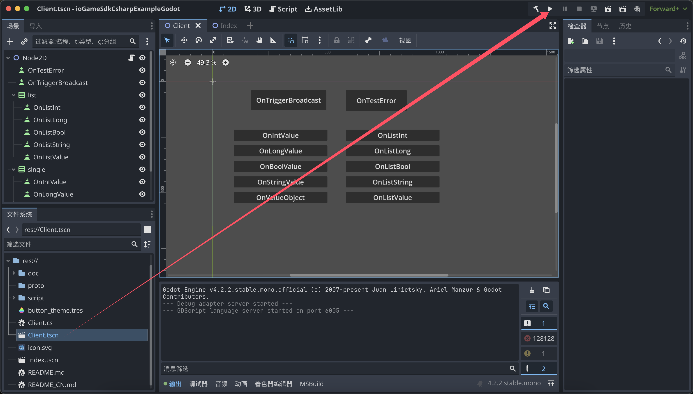
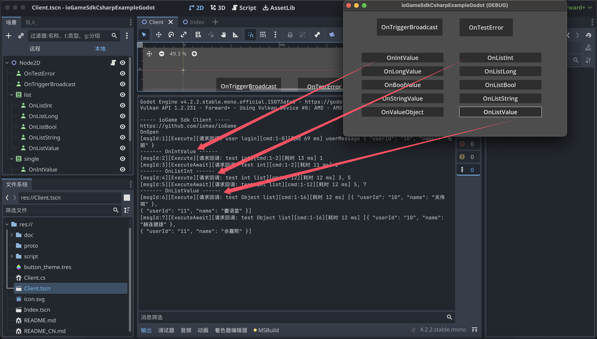

## ioGameSdkCsharpExampleGodot

[Sdk、Godot 示例](https://www.yuque.com/iohao/game/mywnvkhemv8wm396)文档


[ioGame C# SDK](https://github.com/iohao/ioGame/issues/205) 提供了 Netty、WebScoket、Protobuf、C#、[ioGame](https://github.com/iohao/ioGame/) 游戏服务器交互的简单封装。


`./script/gen/code` 目录中的 `action、广播、错误码` ...等交互接口文件由  [ioGame 生成](https://www.yuque.com/iohao/game/irth38)。代码生成可为客户端开发者减少巨大的工作量，并可为客户端开发者屏蔽路由等概念。


**SDK 代码生成的几个优势**

1. 帮助客户端开发者减少巨大的工作量，**不需要编写大量的模板代码**。
2. **语义明确，清晰**。生成的交互代码即能明确所需要的参数类型，又能明确服务器是否会有返回值。这些会在生成接口时就提前明确好。
3. 由于我们可以做到明确交互接口，进而可以明确参数类型。这使得**接口方法参数类型安全、明确**，从而有效避免安全隐患，从而**减少联调时的低级错误**。
4. 减少服务器与客户端双方对接时的沟通成本，代码即文档。生成的联调代码中有文档与使用示例，方法上的示例会教你如何使用，即使是新手也能做到**零学习成本**。
5. 帮助客户端开发者屏蔽与服务器交互部分，**将更多的精力放在真正的业务上**。
6. 为双方联调减少心智负担。联调代码使用简单，**与本地方法调用一般丝滑**。
7. 抛弃传统面向协议对接的方式，转而使用**面向接口方法的对接方式**。
8. 当我们的 java 代码编写完成后，我们的文档及交互接口可做到同步更新，不需要额外花时间去维护对接文档及其内容。


## 快速开始

### 启动游戏服务器

see https://github.com/iohao/ioGameExamples/tree/main/SdkExample


### 启动 Godot

> Godot Version: 4.2.2
>
> 这里的工具使用的是 Rider，工具安装 Godot support 插件后就能正常运行了。

启动客户端后，点击按钮就能与 ioGame 进行通信了。相关的交互的 action 由服务器生成，无需开发者编写。

​	


### 启动页

点击按钮会向服务器发送请求，并接收服务器的响应数据。




### SDK 设置说明

MyNetConfig.cs 文件，该配置文件做了以下事情

1. 错误码及广播监听相关的加载。
2. ListenMessageCallback：自定义消息监听。
3. GameGameConsole：Godot 打印实现。
4. SocketInit()：网络实现的配置、登录、心跳处理。
5. StartNet： 启动 ioGame Sdk。

```csharp
namespace My.Game
{
    public abstract class MyNetConfig
    {
        private static IoGameGodotWebSocket _socket;
        public static long CurrentTimeMillis { get; set; }

        public static void StartNet()
        {
            // biz code init
            GameCode.Init();
            Index.Listen();

            // --------- IoGameSetting ---------
            IoGameSetting.EnableDevMode = true;

            // China or Us
            IoGameSetting.SetLanguage(IoGameLanguage.China);

            IoGameSetting.ListenMessageCallback = new MyListenMessageCallback();
            IoGameSetting.GameGameConsole = new MyGameConsole();

            // socket
            SocketInit();

            IoGameSetting.StartNet();
        }

        public static void Poll()
        {
            // Receiving server messages
            _socket.Poll();
        }

        private static void SocketInit()
        {
            IoGameSetting.Url = "ws://127.0.0.1:10100/websocket";
            _socket = new IoGameGodotWebSocket();
            IoGameSetting.NetChannel = _socket;

            // login
            _socket.OnOpen += () =>
            {
                var loginVerifyMessage = new LoginVerifyMessage { Jwt = "10" };
                SdkAction.OfLoginVerify(loginVerifyMessage, result =>
                {
                    var userMessage = result.GetValue<UserMessage>();
                    result.Log($"userMessage {userMessage}");
                });

                // heartbeat
                IdleTimer();
            };

            _socket.OnConnecting += () => { GD.Print("My OnConnecting"); };
            _socket.OnConnectError += error => { GD.PrintErr($"My OnConnectError --- {error}"); };
            _socket.OnClosing += () => { GD.Print("My OnClosing"); };
            _socket.OnClosed += () => { GD.Print("My OnClosed"); };
        }

        private static async void IdleTimer()
        {
            var heartbeatMessage = new ExternalMessage().ToByteArray();

            var counter = 0;

            while (true)
            {
                await Task.Delay(8000);
                GD.Print($"-------- ..HeartbeatMessage {counter++}");
                // Send heartbeat to server. 发送心跳给服务器
                IoGameSetting.NetChannel.WriteAndFlush(heartbeatMessage);
            }
        }
    }

    internal class MyListenMessageCallback : SimpleListenMessageCallback
    {
        public override void OnIdleCallback(ExternalMessage message)
        {
            var dataBytes = message.Data.ToByteArray();
            var longValue = new LongValue();
            longValue.MergeFrom(new CodedInputStream(dataBytes));
            /*
             * Synchronize the time of each heartbeat with that of the server.
             * 每次心跳与服务器的时间同步
             */
            MyNetConfig.CurrentTimeMillis = longValue.Value;
        }
    }

    internal class MyGameConsole : IGameConsole
    {
        public void Log(object value)
        {
            GD.Print(value);
        }
    }
}
```


## 如何根据 .proto 生成相关 pb

> see compile-proto.sh
>
> https://github.com/protocolbuffers/protobuf/releases


## 最后

记住，你不需要编写任何交互文件（`action、广播、错误码`），这些是由 ioGame 服务器生成的，你只需要关注真正的业务逻辑。


